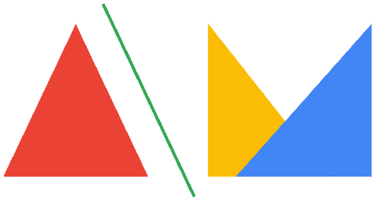

# Portfolio Website

## Made using:

## View it [here :globe_with_meridians:](https://asmit2952.github.io/)

* Steps to run the project locally:

   ` Clone the project`

     `git clone https://github.com/Asmit2952/Asmit2952.github.io.git`

 * Open folder in VSCode

   `cd Asmit2952.github.io`

* Go to `index.html` and run it in live server

Now the website should run locally with no errors, feel free to use this as a template and make changes into it for your own Portfolio.

### Points to note:

* The main web page is divided into 7 sections with different css file for each.
* I have used JavaScript libraries such as [TagCloud.js](https://github.com/mcc108/TagCloud), [Swiper.js](https://swiperjs.com/), [AOS Library](https://github.com/michalsnik/aos) for various animations on my web page.
* For animated rotating words implementation [read this.](https://dev.to/asmit2952/animated-text-sphere-in-javascript-using-tagcloud-js-1p72)
* For contact forms I have used [formsubmit.co](https://formsubmit.co/) 

Feel free to raise issues if you find any bugs in the site. You can also create pull requests to add new features.